# Reconocimiento de objetos en videovigilancia y almacenamiento en sistema distribuido

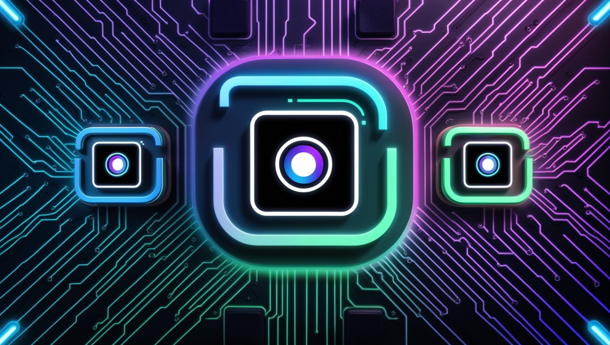

Este proyecto integra inteligencia artificial con almacenamiento distribuido para videovigilancia. Utiliza YOLO para detección de objetos y algoritmos para extraer características. Los datos se gestionan en un clúster con Hive sobre HDFS, permitiendo búsquedas eficientes de objetos similares. Incluye una plataforma web y una API REST para análisis y visualización.

## Tabla de Contenidos


1. Características Principales
2. Requisitos Previos
3. Estructura del Proyecto
4. Guía de Instalación
5. Uso
6. Arquitectura
7. Contribuidores


## Características Principales
- Detección precisa: Identificación de objetos y extracción de características clave en los videos mediante modelos de IA como YOLO.
- Almacenamiento escalable: Gestión eficiente de grandes volúmenes de datos estructurados utilizando Hive sobre HDFS en un clúster distribuido.
- Plataforma web intuitiva: Interfaz para cargar videos, analizar objetos detectados y gestionar resultados de análisis.
- Integración API: Acceso programático para consultar y gestionar datos a través de una API RESTful en el cluster.

## Requisitos Previos

Antes de comenzar, asegúrate de tener instalados los siguientes componentes necesarios para cada parte del sistema:

### API (Python)
La API utiliza Python y requiere las siguientes bibliotecas y herramientas:  
- FastAPI  
- Uvicorn  
- Celery  
- Redis  
- PyHive  
- Thrift  
- Thrift-SASL  

### Inteligencia Artificial (Procesamiento de Videos)
El análisis y detección de objetos requiere las siguientes bibliotecas:  
- OpenAI (para tareas de procesamiento avanzado)  
- dotenv  
- OpenCV  
- NumPy  
- Ultralytics YOLO  

### Backend
El backend requiere:  
- Node.js  
- npm  

### Frontend
El frontend está desarrollado en React y requiere un entorno compatible con Node.js y npm.

### Infraestructura
El sistema se monta en un clúster **Amazon EMR** para proporcionar escalabilidad y procesamiento distribuido. Asegúrate de configurar un clúster adecuado con `Hive` y `HDFS`.  


## Estructura del Proyecto

El proyecto está organizado en varias carpetas principales que representan los diferentes componentes del sistema. A continuación, se proporciona una descripción general de cada carpeta clave:

### 📁 AI_cluster  
Contiene los scripts y herramientas relacionadas con el procesamiento y análisis de datos utilizando modelos de IA.  
- **Principales funciones:** generación de datos, detección de objetos con YOLO, detección de movimiento y procesamiento de videos.  
- **Archivos clave:**  
  - `main.py`: Punto de entrada para ejecutar el análisis principal.  
  - `src/`: Contiene módulos como `gpt_detector.py` y `yolo_detection.py` para tareas específicas de IA.  

### 📁 API_cluster  
Aloja la implementación de la API RESTful en Python.  
- **Principales funciones:** manejo de tareas en segundo plano (Celery), conexión a Hive, y exposición de datos procesados.  
- **Archivos clave:**  
  - `main.py`: Inicia la API con FastAPI.  
  - `tasks.py`: Gestiona tareas en segundo plano.  
  - `requirements.txt`: Lista de dependencias necesarias para el entorno.  
e
### 📁 data_cluster  
Contiene los datos de entrada y scripts para cargar y gestionar tablas en Hive.  
- **Archivos clave:**  
  - `data_sd/`: Archivos CSV con datos de características, objetos y escenarios.  
  - `deploy_hive.py`: Script para desplegar y configurar Hive.  
  - `querys.sql`: Consultas SQL predefinidas para el sistema.  

### 📁 web_platform  
Contiene la implementación de la plataforma web.  
- **Backend:** Construido con Node.js, permite cargar videos y realizar análisis mediante la API.  
  - **Archivos clave:**  
    - `app.js`: Punto de entrada para el servidor backend.  
    - `controllers/`: Lógica de control para procesar videos y gestionar resultados.  
  - **Carpetas adicionales:**  
    - `uploads/`: Almacena videos cargados por los usuarios.  
    - `detections/`: Resultados de análisis de videos, como imágenes y JSON.  
- **Frontend:** Construido con React, proporciona una interfaz para cargar videos, iniciar análisis y visualizar resultados.  
  - **Archivos clave:**  
    - `src/components/`: Componentes principales como botones, listas de videos y resultados.  
    - `App.js`: Entrada principal de la aplicación web.

    
## Guía de Instalación

### 1. Clonar el repositorio

  ``` bash
    git clone https://github.com/angel452/Surveillance-IA-distributed.git
  ```

### 2. Crear el clúster en AWS

Para comenzar, crea el clúster de Amazon EMR. Asegúrate de que el clúster esté configurado con Hive y HDFS para el almacenamiento distribuido.

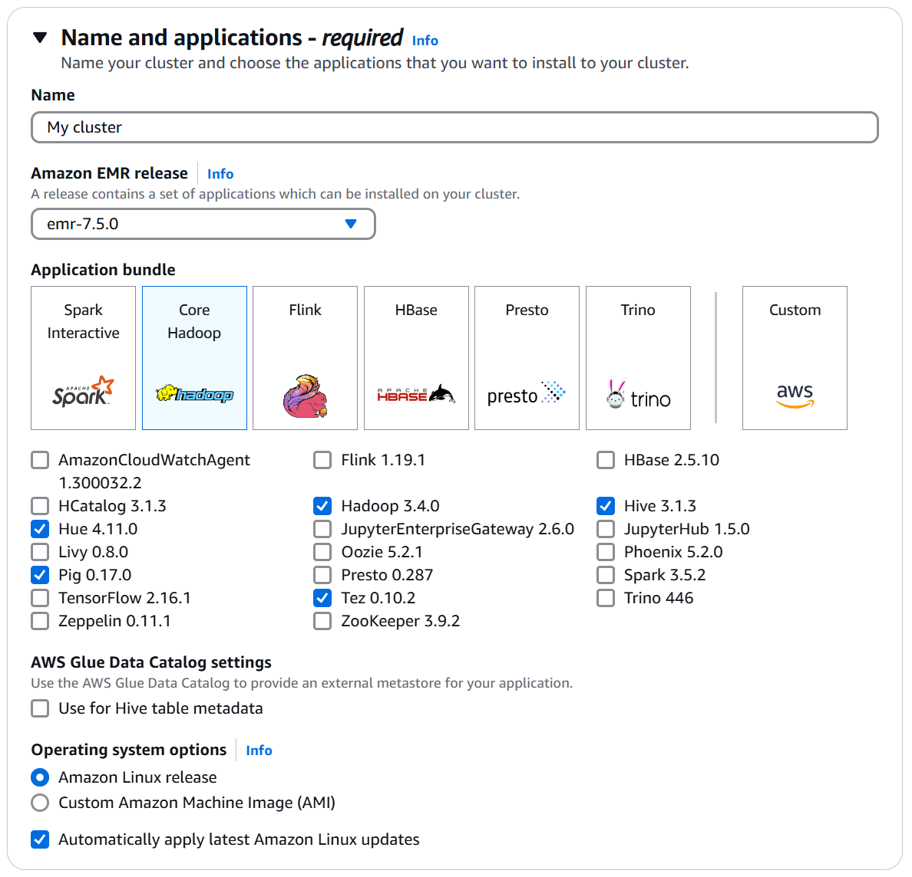
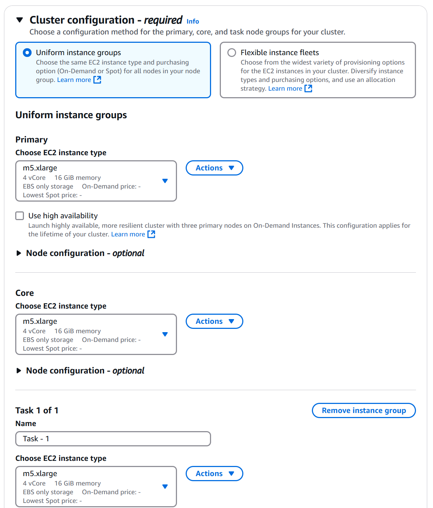
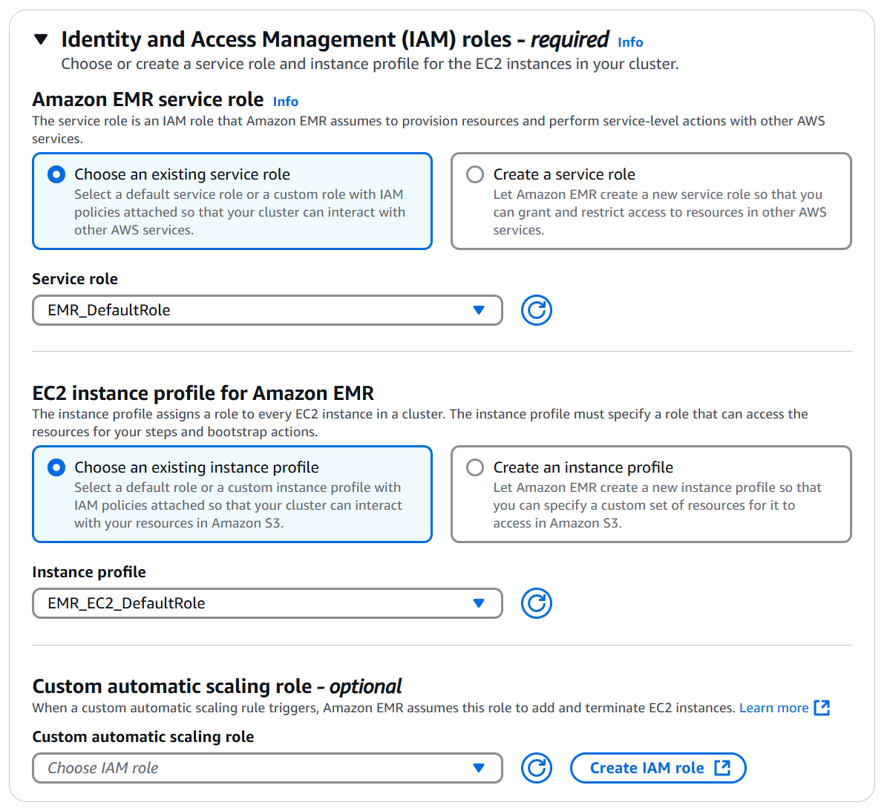


### 3. Subir el código de la API y los datos al clúster

Usa el siguiente comando scp para transferir las carpetas API_cluster y data_cluster al clúster de EC2 en el nodo maestro:

  ``` bash
    scp -i "<ruta_a_tu_llave.pem>" -r API_cluster <usuario>@<dirección_ec2>:/<ruta_destino>
    scp -i "<ruta_a_tu_llave.pem>" -r data_cluster <usuario>@<dirección_ec2>:/<ruta_destino>
  ```

### 4. Configurar el entorno
Una vez que hayas subido los archivos, conéctate a tu instancia EC2 y asegúrate de que todas las dependencias necesarias estén instaladas:

- Para la API en Python, instala las dependencias utilizando pip:

    ``` bash
    pip install -r API_cluster/requirements.txt
    ```

### 5. Instanciar y crear las tablas en Hive

Para crear las tablas necesarias en Hive, entra como usuario root y ejecuta Hive desde la CLI:

1. Accede a la instancia EC2 como root:

    ``` bash
    sudo su 
    ```

2. Lanza la CLI de Hive:
    ``` bash
    hive
    ```
3. Dentro de la CLI de Hive, carga las consultas SQL para crear las tablas usando el archivo querys.sql ubicado en data_cluster o se puede colocar manualmente en el cli de hive todas las consultas:

    ``` bash
    source /home/ec2-user/data_cluster/querys.sql;
    ```
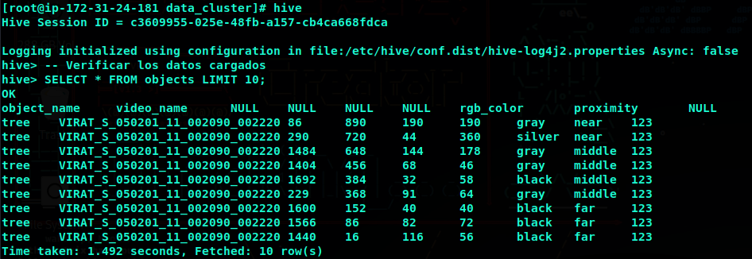

### 6. Iniciar el servidor de la API
Para iniciar el servidor de la API, usa el script `start.sh` dentro de la carpeta `API_cluster`. Si es necesario, puedes modificar el puerto en este archivo antes de ejecutarlo.

1. Navega a la carpeta `API_cluster`:
   ```bash
   cd API_cluster
   ```

2. Si necesitas cambiar el puerto en el que se ejecuta la API, edita el archivo start.sh y ajusta la configuración de puerto:

    ``` bash
    nano start.sh
    ``` 
3. Busca la línea donde se define el puerto y modifícalo según sea necesario.
    ``` bash
    ./start.sh
    ```

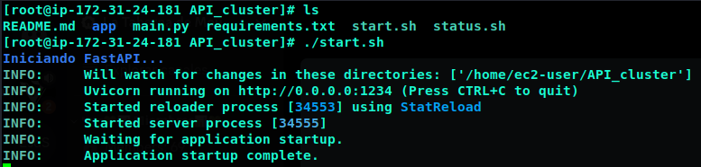

### 7. Levantar la Plataforma Web

1. Antes de instalar las dependencias, asegúrate de configurar las claves de la API:

   - Crea un archivo `.env` dentro de `web_platform/backend/python` y agrega tu clave de OpenAI:
     ```bash
     OPENAI_API_KEY=<api_key_de_open_ai_generada_en_su_sitio_web>
     ```

   - Crea un archivo `.env` en `web_platform/backend` y agrega la URL de la API:
     ```bash
     API_URL=<dominio_donde_se_levanto_el_API>
     ```

2. Luego, instala las dependencias necesarias para Python, el backend y el frontend:

   - Navega a la carpeta `web_platform/backend/python` y ejecuta:
     ```bash
     cd web_platform/backend/python
     pip install -r requirements.txt
     ```

   - Luego, instala las dependencias de Node.js en el backend:
     ```bash
     cd ../
     npm install
     ```

   - Finalmente, instala las dependencias del frontend:
     ```bash
     cd ../../
     npm install
     ```

3. Para iniciar el servidor del backend, ejecuta:
   ```bash
   npm run server
   ```
4. Para iniciar el frontend, ejecuta:
   ``` bash
   npm run start
   ```
Esto levantará la plataforma web con su interfaz interactiva para cargar videos y analizar los datos de videovigilancia.


## 5. Uso
Este sistema permite a los usuarios cargar videos de vigilancia, procesarlos mediante un modelo de Inteligencia Artificial para la detección de objetos y características, y luego realizar consultas sobre estos objetos para búsquedas en una base de datos distribuida. A continuación se describe el flujo de uso del sistema a través de la plataforma web.

### 1. Subir un Video
Una vez que el sistema esté corriendo en el puerto 5000 o 5001, se accederá a la plataforma web. El primer paso es subir un video que será analizado por el sistema. Para ello:
- Haga clic en el botón azul con el texto "Upload Video" para seleccionar el archivo de video desde su dispositivo local.

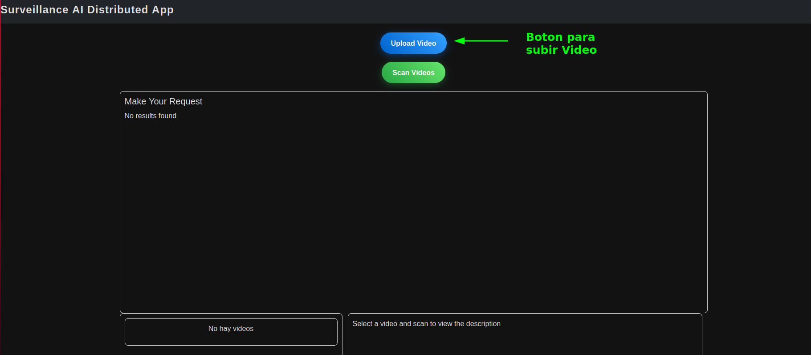

- Después de seleccionar el archivo, el sistema comenzará a cargar el video. Dependiendo del tamaño del video, el proceso puede tardar unos minutos.

- Una vez que el video haya sido cargado exitosamente, aparecerá una alerta en el navegador indicando: "Video Uploaded successfully".

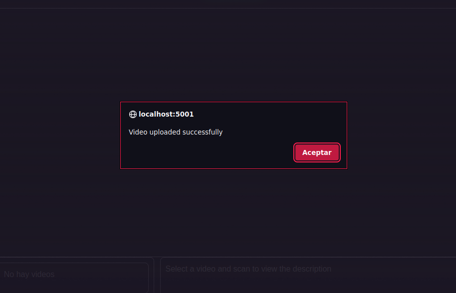

- El video cargado aparecerá en el listado de videos disponibles dentro de la plataforma.

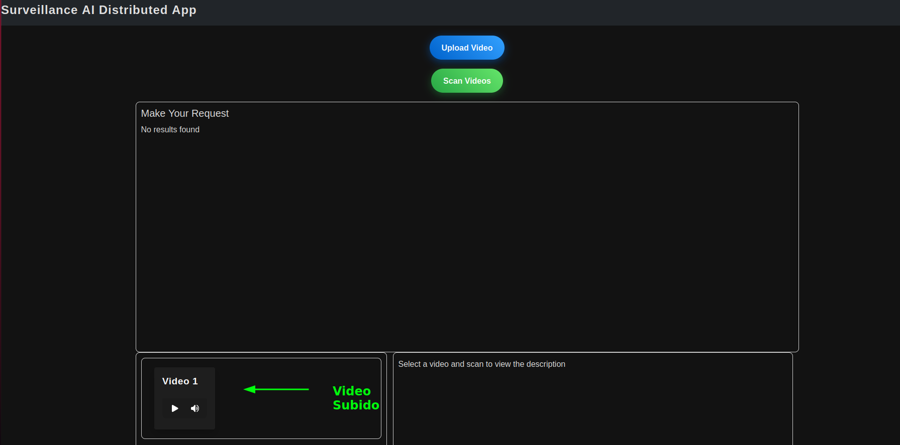

### 2. Escanear el Video
Después de haber subido el video, el siguiente paso es iniciar el proceso de escaneo para la detección de objetos en el video. Para ello:

- Haga clic en el botón "Scan Videos" para iniciar el escaneo del video.

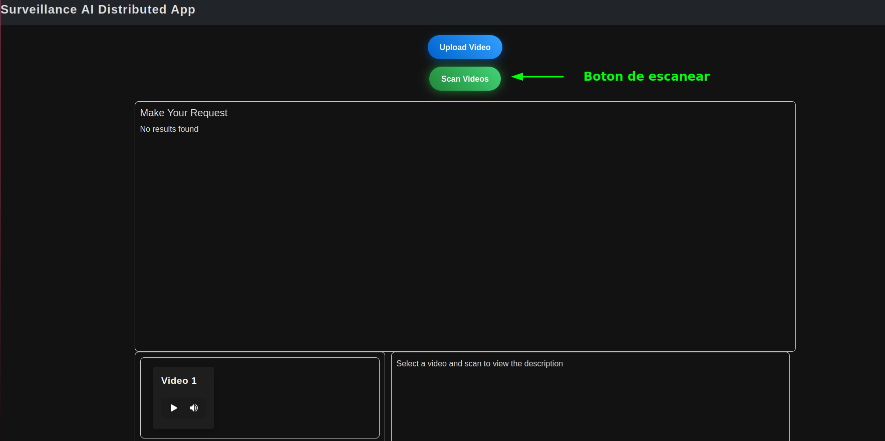

- El proceso de escaneo comenzará, y el texto del botón cambiará a "Scanning..." mientras la IA analiza el video. El tiempo de escaneo depende de la longitud del video.

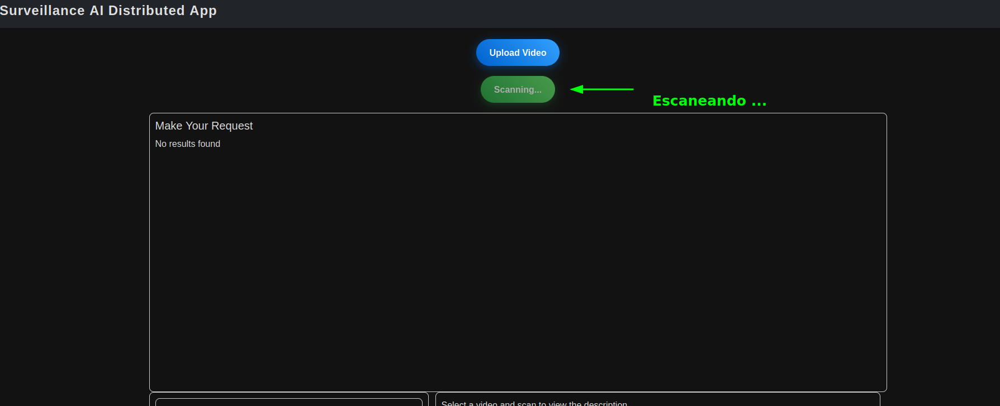

- Una vez que el proceso de escaneo haya finalizado, se mostrará una alerta en el navegador indicando: "Scanning completed successfully".

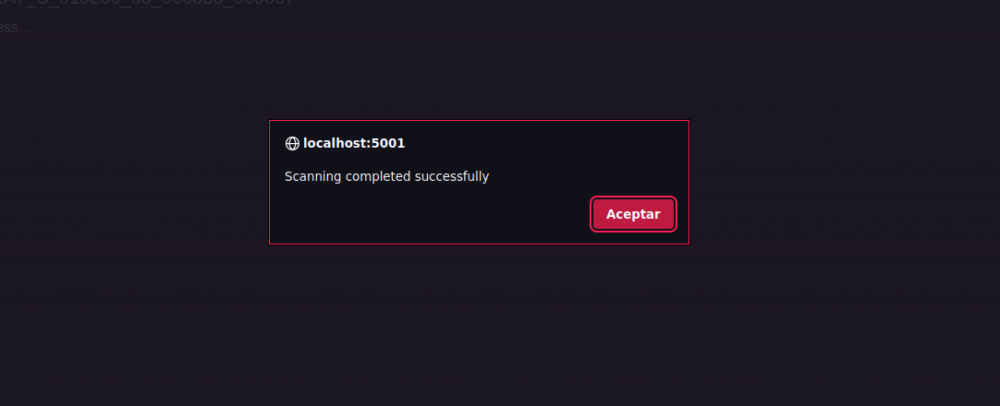

### 3. Resultados del Escaneo de la IA
Tras completar el escaneo, los resultados de la detección de objetos por parte de la IA estarán disponibles en la interfaz de usuario. En la sección "Scan Results", se mostrarán todos los objetos y características detectados durante el análisis.

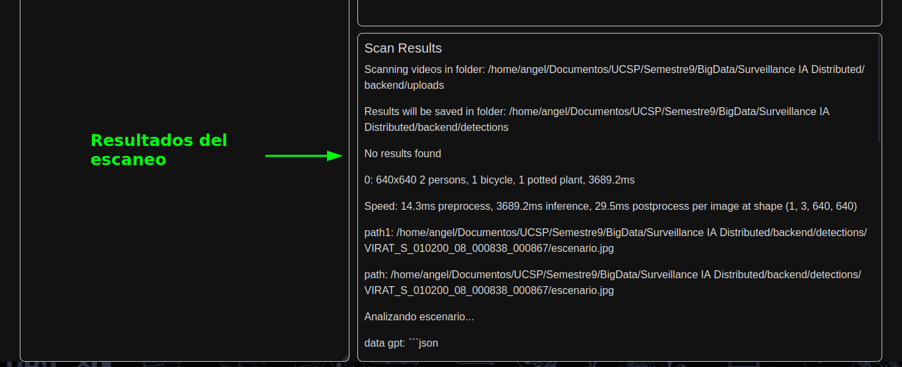

- Además, en la sección "Make your Request", aparecerá una nueva fila en la tabla con botones interactivos que permiten configurar consultas basadas en los objetos y atributos detectados.

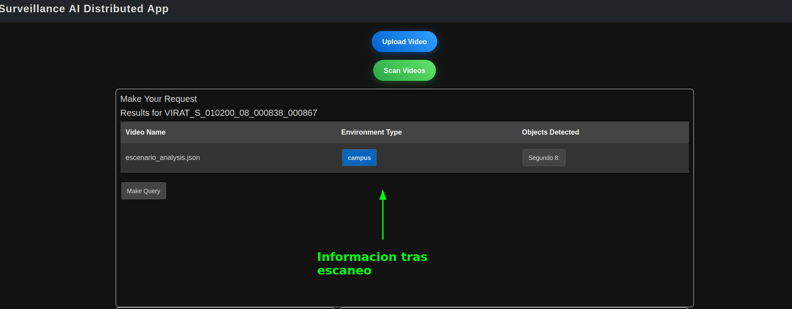

### 4. Visualización de la Tabla General
La plataforma mantiene una tabla general que muestra información clave de cada video procesado. Esta tabla tiene tres columnas:
1. Video Name: El nombre del video subido.
2. Environment Type: El tipo de entorno donde se detectaron los objetos (por ejemplo, "exterior", "interior").
3. Objects Detected: Los objetos detectados en el video, junto con sus características como objeto, color y proximidad.

Al hacer clic en el botón "Objects Detected" de cualquier fila, se desplegará una ventana con información detallada de los objetos detectados, incluyendo las características y la proximidad de los mismos.

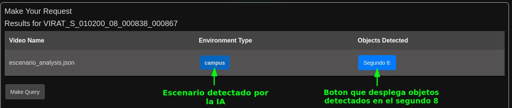
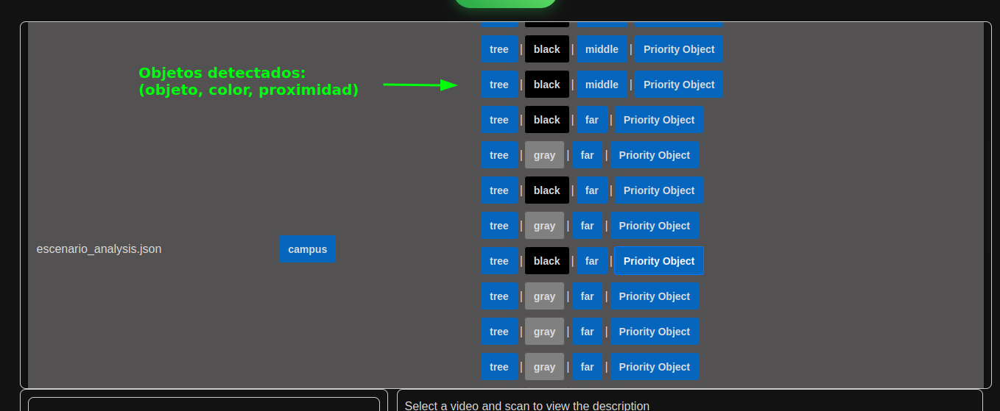

### 5. Realizar Consultas
Los usuarios pueden realizar consultas sobre los objetos detectados en los videos subidos, filtrando por diferentes criterios. Los elementos de la tabla, como Environment Type y Objects Detected, son botones interactivos que se pueden activar o desactivar para configurar las consultas.

Existen tres tipos de consultas que pueden realizarse:

- Consulta Tipo 1: Realice una consulta filtrando solo por el Environment Type. Seleccione el tipo de entorno y presione el botón "Make Query" para iniciar la búsqueda.

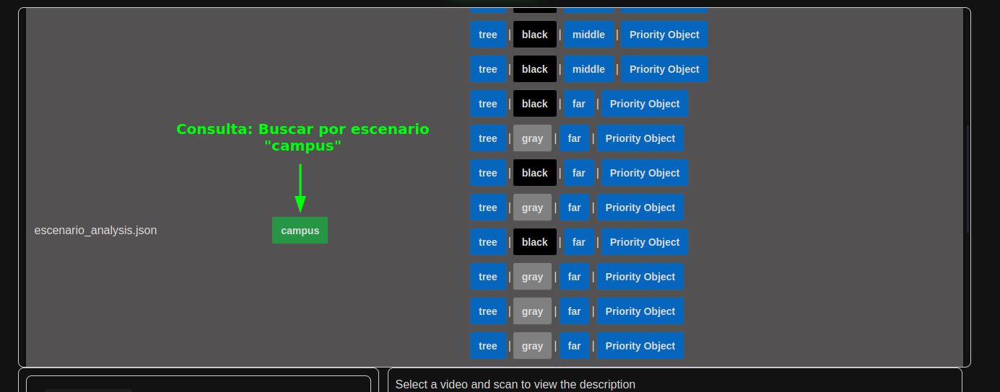

- Consulta Tipo 2: Realice una consulta seleccionando objetos y sus características detectadas en Objects Detected. Puede escoger entre:
  - Solo el objeto.
  - Objeto y color.
  - Objeto, color y proximidad.

Luego, presione el botón "Make Query".


- Consulta Tipo 3: Realice una consulta priorizando un objeto específico. Para ello, seleccione el Objeto y haga clic en el botón "Priority Object". Esta consulta buscará el objeto seleccionando aquellos que aparezcan con mayor frecuencia, otorgándoles prioridad en los resultados.


## 6. Arquitectura
La arquitectura que utlizamos consta de lo siguiente: 
1. Primero, los videos que son ingresados por el frontend en el navegador son procesados por yolo y un LLM para la ubicacion y extrancion de los tags mas relevantes, luego se puede realizar 3 tipos de consultas, que son eviados al nodo maestro del cluster en AWS, a travez de una API personalizada para esta tarea. Estas consultas son realizadas con Hive y la respuesta es enviada de vuelta al frontend, usando el mismo canal.
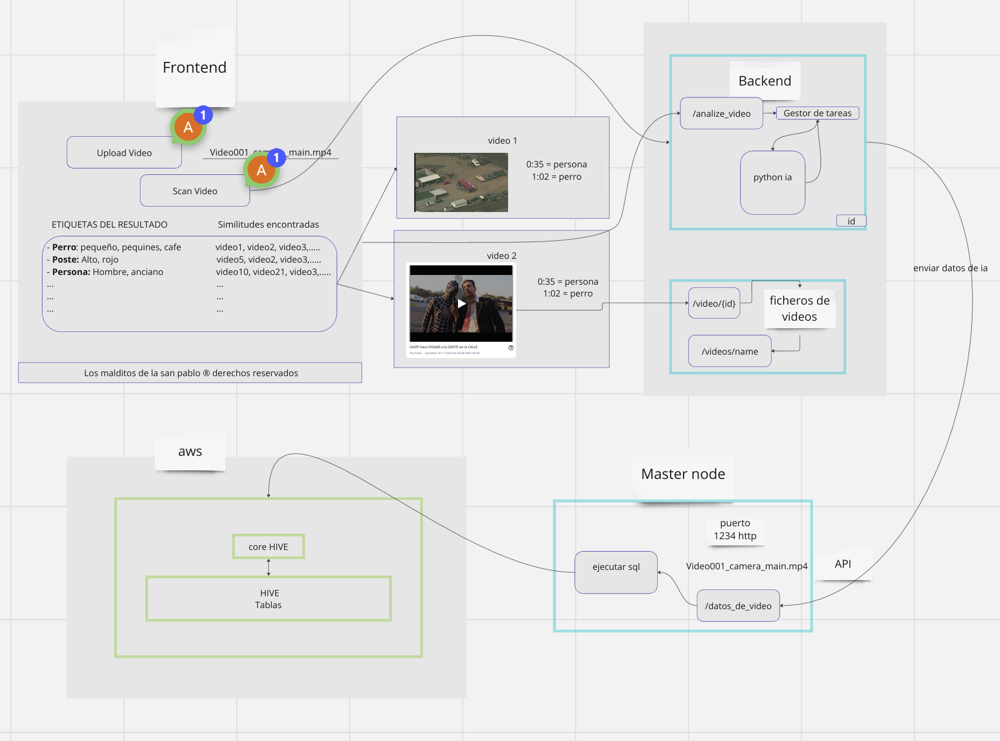
2. Para la extraccion de los tags de los videos, realizamos primero un analisis de movimiento del video, buscando los frames mas relevantes del video. Luego, analizamos las imagenes con yolo para obtener los objetos y sus caracteristicas. En el caso del los enviroments usamos un LLM para su identificacion.
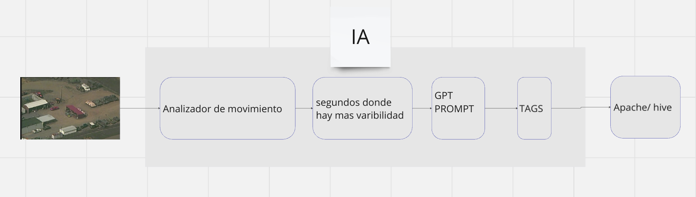
3. Podemos realizar 3 tipos de consultas, luego del analisis del video. La primera, devuelve los videos que poseen el mismo enviroment. En la segunda, devuelve los videos con el mismo objeto y caracteristicas, junto con el segundo preciso de la identificacion. La tercera consulta devuelve en orden de relevacia  los videos donde aparece el objeto, junto con el segundo y las veces de aparicion. Mientras mas veces se identifica el objeto mas arriba en la lista estara.

## 7. Contribuidores

*Los malditos de la San Pablo*
- [Brigham-CG](https://github.com/Brigham-CG)
- [angel452](https://github.com/angel452)
- [Gabriel-Manchego](https://github.com/Gabriel-Manchego)
- [HarryLexvb](https://github.com/HarryLexvb)